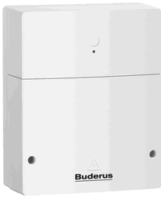

# ioBroker.km200

## ioBroker adapter Buderus KM50/KM100/KM200/KM300 & Junkers/Bosch MB LANi

[German manual](README_DE.md)

The adapter supports the following heating system:
  
*  Buderus with the [network adapters](https://www.buderus.de/de/produkte/catalogue/alle-produkte/7719_gateway-logamatic-web-km200-km100-km50) KM50, KM100, KM200 and KM300
* Junkers with the [network adapter](https://www.bosch-smarthome.com/de/mblani) MB LANi
* Bosch with the [Network Adapter](https://www.bosch-smarthome.com/en/mblani) MB LANi

The heating system can be controlled via the Buderus website ([https://www.buderus-connect.de]) or by the 'EasyControl' app from your mobile phone. App and Buderus website also works with Junkers and Bosch heatings systems.

This has now succeeded in both directions and the adapter is already fully usable.

For this it is necessary to first install the app on a mobile phone and set a private password.
The app asks for the device password and the login name off the device. 

The adapter still needs the IP (or the network name, for example 'BuderusKM200.fritz.box')
and the port address (Port 80 on the device, but if you changed it via a router ...).

Since the adapter must query the data from the system I have defined an update interval,
This is set to a minimum of 5 minutes since every update requires a separate query.

My system (2 heating circuits and a hot water circuit) provides more than 150 data points where I can not use most and some are double.

That's why I introduced a black / push list to hide or show certain data.
This list consists of strings which are formed into RegExp and the services in the heater are then filtered afterwards.

The syntax is that "/ something *" or "- / something *" everything fades out with "/ something" begins and then any characters (or nothing) has.
With "+. * Temp *" you can fade in everything that contains 'temp' and that takes precedence over the faded out!

Mile list looks like `` / gateway * ',' / recordings * ','. * SwitchPrograms. * ',' / HeatSource * ','. * HolidayModes. * "]` And hides about 90 of ~ 150 records my plant off.

Since V 1.1.2 the brackets and commas can be omitted and the blocked / pushed values ​​can only be written with comma!

The system works with services that are structured like a directory tree and this is replicated in the adapter.

## Important
* Adapter requires node >= v6.* 

## changelog

### 1.2.0
* Integrating Schupu's changes and also make the adapter ready for compact mode
* Update of adapter should continue to work with old settings

### 1.1.7
* (Schmupu) Supports Admin3
* (Schmupu) Only device password and own password needed. You do not have to get the access code anymore.

### 1.1.6
Adapter communication and retries more often to catch more errors.
* Writes are also retried
Added blocklist text in config screen

### 1.1.2
* Adapter handles better communication and retries if he got an error.
* you can set debug-mode by adding 'debug!' in front of host.
* Host port is not required and can be added to hostname with: xxx at end.
* Simpler blocklist handling, which does not ask for device which services are blocked

### 0.4.3
* Renamed repository to ioBroker.km200

### 0.4.3
Cleaning of objects / states for current adapters instance which are not part of scanned services anymore.

### 0.4.2
* Some small bug fixes and added some debug logs. Removed so dependency of 'request' and 'async' modules.

### 0.4.1
  Have only 'request' and 'async' with --save now also registered in the package.json ... Remember: Nuícht --save forget :(!

### 0.4.0
  Strings with allowedValues ​​are now converted to ioBroker states in both directions (read & write)

### 0.3.0
  Setting variables with numbers or strings now works.
  Thus, e.g. Target temperatures are changed.
  TODO: Enums and set tables

### 0.2.0
  Adapter now works with blacklist and in read-only mode.
  TODO: Implement setting values ​​in the heating system
  TODO: Implement variables with ENUMS (value lists)

### 0.1.0
  First test

## License
The MIT License (MIT)

Copyright (c) 2016 Frank Joke 

Permission is hereby granted, free of charge, to any person obtaining a copy
of this software and associated documentation files (the "Software"), to deal
in the Software without restriction, including without limitation the rights
to use, copy, modify, merge, publish, distribute, sublicense, and/or sell
copies of the Software, and to permit persons to whom the Software is
furnished to do so, subject to the following conditions:

The above copyright notice and this permission notice shall be included in
all copies or substantial portions of the Software.

THE SOFTWARE IS PROVIDED "AS IS", WITHOUT WARRANTY OF ANY KIND, EXPRESS OR
IMPLIED, INCLUDING BUT NOT LIMITED TO THE WARRANTIES OF MERCHANTABILITY,
FITNESS FOR A PARTICULAR PURPOSE AND NONINFRINGEMENT. IN NO EVENT SHALL THE
AUTHORS OR COPYRIGHT HOLDERS BE LIABLE FOR ANY CLAIM, DAMAGES OR OTHER
LIABILITY, WHETHER IN AN ACTION OF CONTRACT, TORT OR OTHERWISE, ARISING FROM,
OUT OF OR IN CONNECTION WITH THE SOFTWARE OR THE USE OR OTHER DEALINGS IN
THE SOFTWARE.
